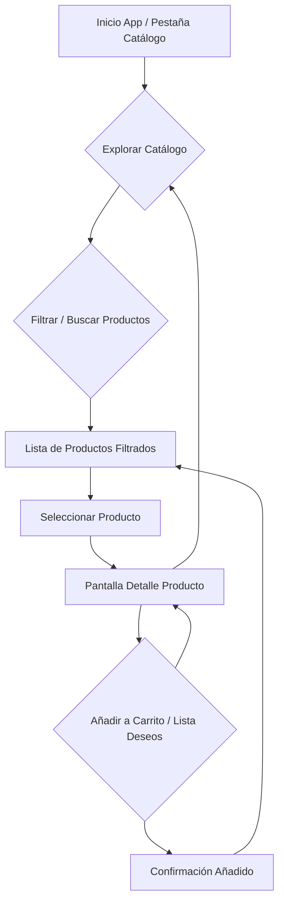

# Flujo de Navegación Detallado del MVP "Global Connect" (Fase 1)

Este documento describe el flujo de usuario y la navegación detallada para las cuatro pestañas principales de la aplicación "Global Connect" en su fase MVP. El objetivo es proporcionar una comprensión clara de cómo los minoristas interactuarán con cada funcionalidad.

## 1. Flujo de Navegación: Catálogo Digital Interactivo

El flujo del Catálogo Digital Interactivo permite a los minoristas explorar y seleccionar productos de manera eficiente.



**Descripción del Flujo:**

1.  **Inicio App / Pestaña Catálogo:** El usuario accede a la aplicación y la pestaña "Catálogo" es la vista por defecto o la primera a la que navega.
2.  **Explorar Catálogo:** El usuario visualiza una lista o cuadrícula de productos artesanales.
3.  **Filtrar / Buscar Productos:** El usuario puede aplicar filtros (categoría, precio, origen) o usar la barra de búsqueda para refinar los resultados.
4.  **Lista de Productos Filtrados:** Se muestran los productos que cumplen con los criterios de búsqueda o filtrado.
5.  **Seleccionar Producto:** El usuario elige un producto de la lista para ver más detalles.
6.  **Pantalla Detalle Producto:** Se presenta información completa del producto, incluyendo imágenes, descripción, stock y precio.
7.  **Añadir a Carrito / Lista Deseos:** Desde la pantalla de detalle, el usuario puede añadir el producto a un carrito temporal o a una lista de deseos.
8.  **Confirmación Añadido:** Se muestra una confirmación visual de que el producto ha sido añadido.

## 2. Flujo de Navegación: Gestión de Pedidos "One-Tap"

El flujo de Pedidos "One-Tap" simplifica el proceso de compra, permitiendo transacciones rápidas.

```mermaid
graph TD
    A[Pestaña Pedidos] --> B{Ver Historial Pedidos}
    B --> C[Lista de Pedidos Anteriores]
    C --> D[Seleccionar Pedido]
    D --> E[Detalle de Pedido]

    F[Pantalla Detalle Producto (desde Catálogo)] --> G{Botón "One-Tap" Comprar}
    G --> H[Pantalla Confirmación Compra]
    H --> I{Confirmar Pago / Envío}
    I --> J[Pedido Realizado / Confirmación]
    J --> B
```

**Descripción del Flujo:**

1.  **Pestaña Pedidos:** El usuario navega a la pestaña "Pedidos".
2.  **Ver Historial Pedidos:** Se muestra un listado de todos los pedidos realizados previamente.
3.  **Lista de Pedidos Anteriores:** El usuario puede ver un resumen de cada pedido.
4.  **Seleccionar Pedido:** El usuario elige un pedido para ver sus detalles.
5.  **Detalle de Pedido:** Se muestra información exhaustiva sobre un pedido específico.
6.  **Pantalla Detalle Producto (desde Catálogo):** El usuario está viendo un producto en el catálogo.
7.  **Botón "One-Tap" Comprar:** El usuario presiona el botón de compra directa.
8.  **Pantalla Confirmación Compra:** Se presenta un resumen del pedido con la dirección de envío y método de pago preestablecidos.
9.  **Confirmar Pago / Envío:** El usuario confirma la compra.
10. **Pedido Realizado / Confirmación:** Se muestra una confirmación de que el pedido ha sido procesado exitosamente.

## 3. Flujo de Navegación: Módulo de Seguimiento Básico

El módulo de Seguimiento Básico permite a los minoristas monitorear el estado de sus envíos internacionales.

```mermaid
graph TD
    A[Pestaña Tracking] --> B{Ver Lista de Envíos}
    B --> C[Lista de Envíos Activos]
    C --> D[Seleccionar Envío]
    D --> E[Detalle de Seguimiento]
    E --> F[Hitos de Estado (Aduanas, En Tránsito, Entregado)]
```

**Descripción del Flujo:**

1.  **Pestaña Tracking:** El usuario navega a la pestaña "Tracking".
2.  **Ver Lista de Envíos:** Se muestra un listado de todos los envíos activos o recientes.
3.  **Lista de Envíos Activos:** El usuario puede ver un resumen del estado actual de cada envío.
4.  **Seleccionar Envío:** El usuario elige un envío para ver su trazabilidad detallada.
5.  **Detalle de Seguimiento:** Se presenta una vista detallada del progreso del envío.
6.  **Hitos de Estado:** Se muestran los diferentes hitos por los que ha pasado el envío, como "Aduanas", "En Tránsito" y "Entregado", con sus respectivas fechas.

## 4. Flujo de Navegación: IA Smart Curator

El Smart Curator ofrece recomendaciones de stock personalizadas basadas en inteligencia artificial.

```mermaid
graph TD
    A[Pestaña IA Smart Curator] --> B{Ver Recomendaciones}
    B --> C[Panel de Recomendaciones]
    C --> D{Explorar Productos Recomendados}
    D --> E[Seleccionar Producto Recomendado]
    E --> F[Pantalla Detalle Producto (desde Recomendación)]
    F --> G{Añadir a Carrito / Ver Más}
    G --> C
```

**Descripción del Flujo:**

1.  **Pestaña IA Smart Curator:** El usuario navega a la pestaña "IA Smart Curator".
2.  **Ver Recomendaciones:** Se carga el panel con las sugerencias de productos.
3.  **Panel de Recomendaciones:** Se muestran productos organizados por categorías como "Tendencias Actuales" o "Para Tu Tienda".
4.  **Explorar Productos Recomendados:** El usuario puede desplazarse y visualizar las diferentes recomendaciones.
5.  **Seleccionar Producto Recomendado:** El usuario elige un producto de la lista de recomendaciones para ver más detalles.
6.  **Pantalla Detalle Producto (desde Recomendación):** Se muestra la información completa del producto recomendado.
7.  **Añadir a Carrito / Ver Más:** Desde esta pantalla, el usuario puede añadir el producto al carrito o volver al panel de recomendaciones.

## Próximos Pasos

Con la arquitectura de archivos y los flujos de navegación detallados, la Fase 1 está completa. Por favor, revise este documento y valide la Fase 1 para que podamos proceder con la Fase 2: Motor de Cálculo y Métricas de Validación.
